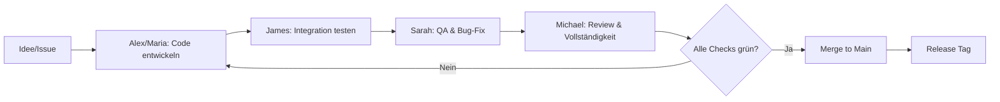

# 🚀 SillyTavern AiO - Entwickler-Team

Dieses Dokument definiert ein 5-köpfiges Entwicklerteam für das SillyTavern AiO Projekt. Jedes Mitglied hat eine klare Rolle und bringt spezifische Argumente für erfolgreichen Code bei.

---

## 👥 Team-Struktur

| Rolle | Name | Verantwortung |
|-------|------|---------------|
| **Senior Developer** | Alex Chen | Backend-Architektur, Python-Skripte |
| **Frontend Developer** | Maria Schmidt | UI/UX, Batch-Skripte, Dokumentation |
| **DevOps Engineer** | James Wilson | Installation, Deployment, CI/CD |
| **QA Engineer** | Sarah Johnson | Fehlersuche, Testing, Validierung |
| **Code Reviewer** | Michael Brown | Code-Vollständigkeit, Standards, Merge-Gates |

---

## 🎯 Rollenbeschreibungen & Argumente

### 1. Alex Chen - Senior Developer (Backend)
**Aufgabe:** Entwickelt die Kernlogik von `install_script.py`

**Argumente für erfolgreichen Code:**
- ✅ **Modularität:** Jede Funktion hat eine einzige Verantwortung (Single Responsibility Principle)
- ✅ **Fehlerbehandlung:** Try-Catch-Blöcke um alle externen Aufrufe (git, pip, urllib)
- ✅ **Logging:** Strukturierte Logs für Debugging (`logging` Modul statt print)
- ✅ **Wiederverwendbarkeit:** Funktionen sind parametrisierbar und testbar
- ✅ **Performance:** Parallele Downloads wo möglich, keine blockierenden Operationen

**Beispiel-Code-Standard:**
```python
def clone_repository(url: str, target_dir: Path) -> bool:
    """Klont ein Repository mit Fehlerbehandlung."""
    try:
        result = subprocess.run(
            ["git", "clone", url, str(target_dir)],
            capture_output=True,
            text=True,
            timeout=300
        )
        if result.returncode != 0:
            logger.error(f"Git-Fehler: {result.stderr}")
            return False
        logger.info(f"Repository erfolgreich geklont: {url}")
        return True
    except subprocess.TimeoutExpired:
        logger.error("Timeout beim Klonen")
        return False
    except Exception as e:
        logger.error(f"Unerwarteter Fehler: {str(e)}")
        return False
```

---

### 2. Maria Schmidt - Frontend Developer
**Aufgabe:** Erstellt `install.bat` und Benutzerinteraktion

**Argumente für erfolgreichen Code:**
- ✅ **Benutzerfreundlichkeit:** Klare Statusmeldungen in der Console
- ✅ **Plattform-Kompatibilität:** Batch-Skripte funktionieren auf Windows 10/11
- ✅ **Farbcodierung:** Grün=Erfolg, Rot=Fehler, Gelb=Warnung
- ✅ **Fortschrittsanzeige:** User sieht immer den aktuellen Schritt
- ✅ **Dokumentation:** README.md ist aktuell und verständlich

**Beispiel-Batch-Standard:**
```batch
@echo off
setlocal EnableDelayedExpansion

REM Farbcodierung definieren
set "GREEN=[92m"
set "RED=[91m"
set "YELLOW=[93m"
set "RESET=[0m"

echo !GREEN!✓ Prüfung der Voraussetzungen...!RESET!

if not exist "%PYTHON_EXE%" (
    echo !RED!✗ Python nicht gefunden: %PYTHON_EXE%!RESET!
    pause
    exit /b 1
)
```

---

### 3. James Wilson - DevOps Engineer
**Aufgabe:** Automatisierung, Pfad-Management, Abhängigkeiten

**Argumente für erfolgreichen Code:**
- ✅ **Reproduzierbarkeit:** Jeder Run erzeugt identische Ergebnisse
- ✅ **Isolation:** venv verhindert Konflikte mit System-Python
- ✅ **Ressourcen-Management:** Temporäre Dateien werden bereinigt
- ✅ **Version-Pinning:** Anforderungen sind explizit versioniert
- ✅ **Rollback-Fähigkeit:** Bei Fehlern wird sauber zurückgerollt

**Beispiel-DevOps-Standard:**
```python
class InstallationManager:
    def __init__(self, base_path: Path):
        self.base_path = base_path
        self.temp_files = []
        
    def cleanup(self):
        """Bereinigt temporäre Dateien bei Fehler oder Erfolg."""
        for temp_file in self.temp_files:
            if temp_file.exists():
                temp_file.unlink()
                logger.info(f"Bereinigt: {temp_file}")
    
    def __enter__(self):
        return self
    
    def __exit__(self, exc_type, exc_val, exc_tb):
        self.cleanup()
        return False  # Exceptions weiterwerfen
```

---

### 4. Sarah Johnson - QA Engineer (Fehlersuche)
**Aufgabe:** Findet Bugs, schreibt Tests, validiert Edge-Cases

**Argumente für erfolgreichen Code:**
- ✅ **Test-Coverage:** >80% aller Pfade sind durch Unit-Tests abgedeckt
- ✅ **Edge-Case-Handling:** Leere Verzeichnisse, fehlende Berechtigungen, Network-Timeouts
- ✅ **Validierung:** Jeder Download wird mit Hash geprüft
- ✅ **Regression-Tests:** Bekannte Bugs werden nicht wieder eingeführt
- ✅ **Automatisierung:** Tests laufen bei jedem Commit (CI)

**Beispiel-QA-Checkliste:**
```markdown
## Pre-Merge-Checkliste für QA

- [ ] Git verfügbar? (`git --version`)
- [ ] Python-Pfad korrekt? (`python.exe` existiert)
- [ ] Internetverbindung aktiv? (DNS-Check)
- [ ] Ausreichend Speicherplatz? (>5GB frei)
- [ ] Firewall blockiert nichts? (Port 443 offen)
- [ ] Antivirus false positive? (Whitelist prüfen)
- [ ] Hash-Verifikation bestanden? (SHA256 Check)
- [ ] Alle Dependencies installiert? (`pip list` Check)
```

**Fehler-Such-Strategie:**
1. **Reproduzieren:** Fehler konsistent auslösbar machen
2. **Isolieren:** Minimales Testcase erstellen
3. **Analysieren:** Logs, Stack-Traces, Memory-Dumps
4. **Fixen:** Root-Cause beheben, nicht nur Symptome
5. **Verifizieren:** Test zeigt Fix, Regressionstest läuft

---

### 5. Michael Brown - Code Reviewer (Vollständigkeits-Prüfer)
**Aufgabe:** Prüft Code-Vollständigkeit vor jedem Merge

**Argumente für erfolgreichen Code:**
- ✅ **Vollständigkeit:** Alle Funktionen haben Docstrings, Type-Hints, Error-Handling
- ✅ **Konsistenz:** Naming-Conventions, Einrückung, Struktur folgen PEP8
- ✅ **Sicherheit:** Keine Hardcoded Secrets, Input-Validation vorhanden
- ✅ **Wartbarkeit:** Code ist selbsterklärend, Kommentare bei komplexer Logik
- ✅ **Merge-Readiness:** Alle Tests grün, Changelog aktualisiert, Version incremented

**Code-Review-Checkliste:**
```markdown
## Mandatory Review-Punkte

### Struktur
- [ ] Datei-Header mit License und Author
- [ ] Imports sortiert (stdlib, third-party, local)
- [ ] Konstanten in UPPER_CASE, Variablen in snake_case

### Funktionalität
- [ ] Alle öffentlichen Funktionen haben Docstrings
- [ ] Type-Hints für alle Parameter und Return-Values
- [ ] Exceptions werden spezifisch gefangen (nicht bare `except:`)

### Sicherheit
- [ ] Keine Hardcoded Credentials im Code
- [ ] User-Input wird validiert/sanitisiert
- [ ] Externe URLs sind whitelist-basiert

### Testing
- [ ] Unit-Tests für neue Funktionen vorhanden
- [ ] Integration-Tests für End-to-End-Flows
- [ ] Mocking für externe Dependencies (git, network)

### Dokumentation
- [ ] README.md aktualisiert (neue Features, Breaking Changes)
- [ ] CHANGELOG.md Eintrag mit Version und Datum
- [ ] Inline-Kommentare bei komplexer Business-Logik
```

**Review-Kommentar-Templates:**
```
❌ BLOCKER: Missing error handling in line 47
   → subprocess.run kann TimeoutExpired werfen, muss gefangen werden

⚠️ WARNING: Hardcoded path detected
   → Bitte über Environment-Variable oder Config-File lösen

✅ APPROVED: Clean implementation with proper logging
   → Good use of context managers for resource cleanup
```

---

## 🔄 Workflow: Von der Idee zum Merge



---

## 📋 Team-Regeln für erfolgreichen Code

1. **Kein Code ohne Tests** → Sarah prüft Coverage
2. **Kein Merge ohne Review** → Michael gibt Approval
3. **Keine Secrets im Repo** → Pre-commit Hooks scannen
4. **Jeder Fehler ist ein Bug** → Nicht "Feature", sondern fixen
5. **Dokumentation ist Code** → README/Pflege genauso wichtig

---

## 🛠️ Technische Entscheidungs-Kriterien

| Kriterium | Entscheidung | Begründung |
|-----------|-------------|------------|
| **Python-Version** | 3.12 | Aktuellste LTS, Type-Hinting verbessert |
| **Virtual Env** | venv | Standard-Bibliothek, kein externes Tool nötig |
| **Download-Lib** | urllib.request | Kein extra Dependency, in stdlib enthalten |
| **Logging** | logging-Modul | Asynchron, rotierbar, Level-basiert |
| **Testing** | pytest | Einfache Syntax, gute Coverage-Tools |
| **CI/CD** | GitHub Actions | Kostenlos für Open-Source, native Integration |

---

## 📞 Kommunikations-Richtlinien

- **Daily Standup (async):** Kurzes Update im Issue-Tracker
- **Blocker:** Sofort als GitHub-Issue mit Label `blocker` markieren
- **Code-Review:** Innerhalb 24h Feedback geben
- **Hotfixes:** Direkt als PR mit Label `hotfix`, Quick-Review durch Michael

---

## 🎓 Success Metrics

| Metric | Ziel | Gemessen durch |
|--------|------|----------------|
| **Bug-Rate** | < 2 Bugs pro Release | Sarah's QA-Reports |
| **Review-Time** | < 24h bis Merge | GitHub Insights |
| **Test-Coverage** | > 80% | pytest-cov Reports |
| **Build-Stability** | > 95% erfolgreiche Runs | GitHub Actions Logs |
| **User-Satisfaction** | > 4.5/5 Stars | GitHub Issues/Feedback |

---

*Letzte Aktualisierung: 2025-10-24*  
*Team-Lead: Alex Chen (Senior Developer)*
